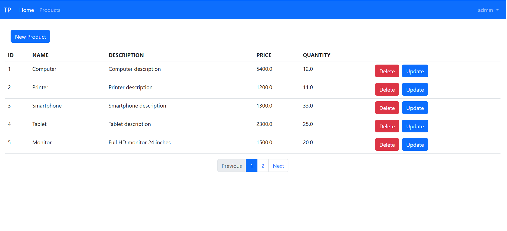
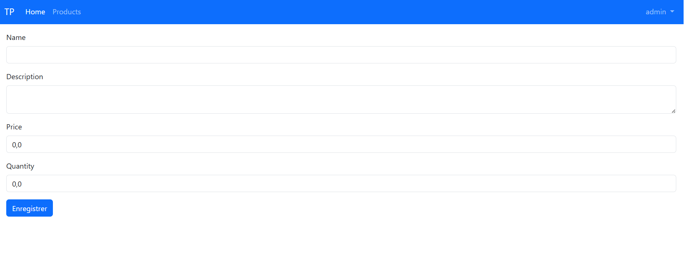
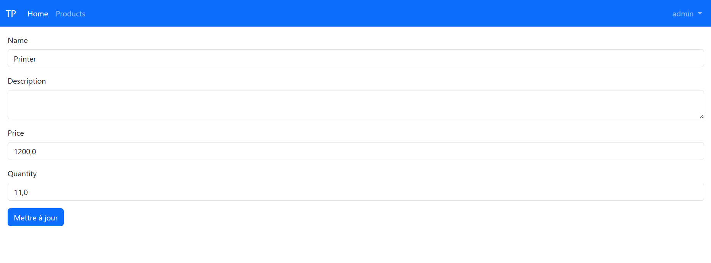

# Spring Boot Product Management
Une application simple de gestion de produits avec authentification, pagination, et affichage via Thymeleaf.

## Fonctionnalités

- Authentification des utilisateurs (Spring Security)
- Visualisation des produits pour les utilisateurs avec rôle `USER`
- Pagination intégrée avec `Pageable`
- Interface frontend avec Thymeleaf

## Technologies utilisées

- Java 17+
- Spring Boot 3.x
- Spring Security
- Spring Data JPA
- Thymeleaf
- H2 / MySQL
- Maven

## Captures d'écran

### Login Page

---

### Home Page (Liste des produits)

---

### Add New Product

---

### Update Product
